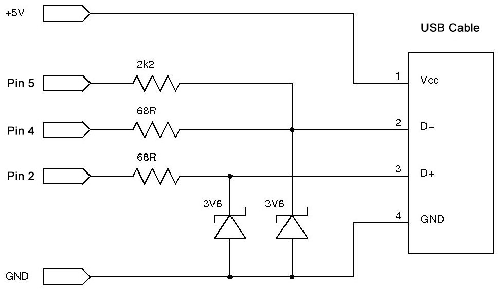

# absolute-mouse


Arduino library to control cursor over USB, using absolute positioning. 
Based on Obdev's VUSB driver, via [UsbMouse](https://github.com/meirm/UsbMouse)

The techniques used to deliver absolute positioning are slightly hacky. Because of this,  **your results may vary.** See [Configuration](#configuration)

If you do not require absolute positioning, you may instead want to emulate a more traditional mouse with [glaukon-ariston's fork of UsbMouse](https://github.com/glaukon-ariston/UsbMouse). <br />
<br />
[Absolute Positioning](#what-is-absolute-positioning) <br />
[Wiring](#wiring) <br />
[Configuration](#configuration) <br />
[Using the Library](#using-the-library) <br />
[DevKit](#devkit-sketch) <br />
[Timers](#timers) <br />
[Installation](#installation) <br />
<br />

### What is absolute positioning?

| Absolute Positioning |         Relative Positioning     |
|----------------------|----------------------------------|
| Place the cursor 3cm from left edge, 10cm from top edge. | Move the cursor to the left and then down.|

This library uses absolute co-ordinates. It allows you to move the cursor to a fixed point, without user feedback.<br />

Depending on your configuration, co-ordinates can be given in pixels, millimeters, percentages, or anything else you can dream up. See [Screen Dimensions](#screen-dimensions)

---

## Wiring
This library makes use of Obdev's VUSB driver. The suggested wiring for Arduino UNO is as follows:



You will get away with some deviation here (resistor values, level shifting alternatives); just remember that the D+ / D- lines will be **very** unhappy if they start to see much more than 3.3V

---

### Configuration
**You must configure the library to match your target device.**

This should be done at the top of your sketch, before you import the library. There are several preconfigured profiles available:

Operating System | Profile
---|---
Android | `#define PROFILE_ANDROID`
Mac OS | `#define PROFILE_MAC`
Ubuntu | `#define PROFILE_UBUNTU`
Windows 10 | `#define PROFILE_WINDOWS`
Windows 7 | `#define PROFILE_WINDOWS`
Windows XP | `#define PROFILE_WINXP`

These profiles were tested prior to release, however some hardware may require additional configuration options. If in doubt, `POLL_WITH_TIMER1`. For example,

```cpp
// One USB hub tested with Windows 10 required additional polling
#define PROFILE_WINDOWS
#define POLL_WITH_TIMER1
```

Alternatively, you can manually specify a custom profile:

Option | Description
:---|:---
`#define EMULATE_MOUSE` | Control the cursor with a mouse
`#define EMULATE_STYLUS` | Control the cursor with a pen
`#define EMULATE_HYBRID` | Use a mixture of mouse and pen controls
`#define POLL_WITH_TIMER1` | Keep connection alive using Timer 1
`#define POLL_WITH_TIMER2` | Keep connection alive using Timer 2
`#define ENABLE_HOMING` | Re-align cursor before each command

`PROFILE_UBUNTU` and `PROFILE_WINXP` use timers; Timer 1 by default. Feel free to change this.
```cpp
#define PROFILE_UBUNTU
#define POLL_WITH_TIMER2
``` 

See [Timers](#timers) for more info.

## Using the library

```cpp
#define PROFILE_WINDOWS

#include <absolute-mouse.h>

void setup() {
    AbsoluteMouse.begin();
    AbsoluteMouse.click(50, 50);    //Middle of screen
}
```

### Screen Dimensions
By default, absolute-mouse interprets co-ordinates as "percentages" (see example above). You are encouraged to adjust this to suit your needs, by either:

```cpp
// Passing your dimensions during setup, or
AbsoluteMouse.begin(1440, 900);

// Setting them manually when appropriate
AbsoluteMouse.set_dimensions(1440, 900);
```
You are free to define any width and height (less than 32768).
Consider setting dimensions to your screen's width in mm: 

```cpp
AbsoluteMouse.set_dimensions(310, 175);
```

### Right & Bottom

Negative coordinates are intepretted as offset from the opposite edge. This just makes life easier sometimes.
```cpp
// Screen is 310mm wide, 175mm tall
AbsoluteMouse.set_dimensions(310, 175);

// Click 5mm from left, 10mm up from bottom
// (Aka Windows 10 Start Menu)
AbsoluteMouse.click(5, -10)
```

Available commands vary slightly depending or which profile is selected. For a full list of commands, see [here](/doc/function_list.md), or consult the `help` command in the DevKit terminal.

---

## DevKit Sketch
Determining the correct command and position for each mouse operation can be a tiresome task. To reduce this burden, the library comes bundled with a DevKit sketch. You will find this with the rest of the examples.

Flash the sketch to your UNO and open a serial monitor (9600 baud) to access a commandline for executing absolute-mouse commands.

**Note: 5V should not be connected to target device when using DevKit.** <br />
[Find out more](doc/self-powered/warning.md)

---

## Timers
It appears that some operating systems require constant usb polling (every 50 ms or so). This is employed by `PROFILE_UBUNTU` and `PROFILE_WINXP`. By default, this is handled by TIMER1. Because of the low frequency, TIMER1 is best suited. Because many other libraries make use of TIMER1, there is an option to instead use TIMER2, in conjuction with a counter. This should be saved as a backup, as it will use slightly more processing power

Many VUSB-based projects disable Timer0, stating that it interferes with USB timing. I haven't found this to be an issue, so long as the library internally avoids using Timer0 for timing.

At this point, Timer0 remains enabled, however I will continue to monitor the situation.

---

## Installation

Arduino: Library can be installed to Arduino IDE with Sketch -> Include Library -> Add .Zip Library.., or through the built-in Library Manager.

[Platform.io](https://platformio.org/): Available through the built-in library registiry, or alternatively, can be installed by extracting the Zip file to the lib folder of your project.
