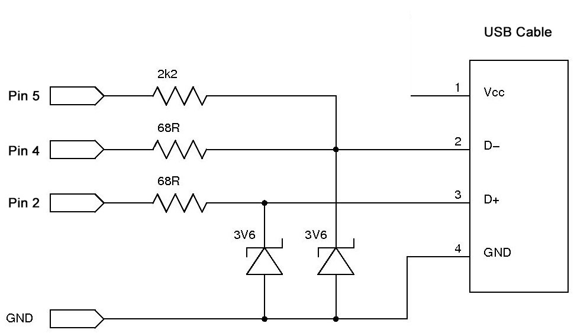

## DevKit Precautions
Many users of the DevKit sketch will be connecting their Arduino's Serial output to one machine, and the USB output to a separate target machine.

Some target devices may not have been designed to receive external power input on the USB 5V line.

It is advised, when the Arduino is simultaneously connected to two devices, that you do not connect 5V to the target machine. In this configuration, the USB device (Arduino) is "self-powered".

This removes the potential for a slight imbalance in voltage between the two machines to cause one 5V supply to "drive" the other.

I do not believe that this is a critical issue. On occasion, I have briefly connected the 5V line between two machines with no apparent issues.

As I am not knowledgable enough to make a definitive statement on this issue, I suggest, that when using *the DevKit*, you follow this suggested wiring for a "self-powered" VUSB device:

